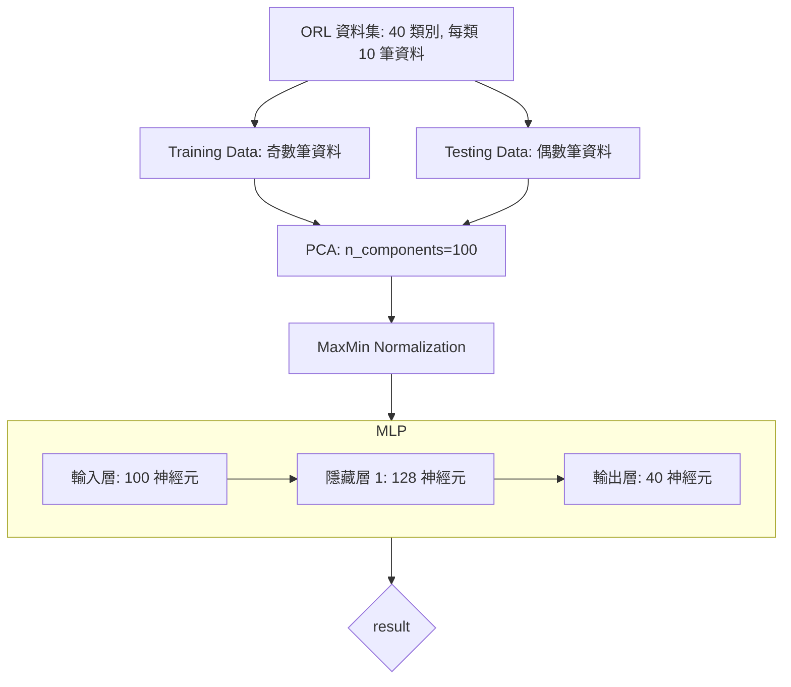

## facial-recognition_MLP
Utilized PCA and MaxMin Normalization and implemented a MLP for facial image recognition
### 流程

```mermaid
graph TD
    A[ORL 資料集: 40 類別, 每類 10 筆資料] 
    A --> B[Training Data: 奇數筆資料] 
    A --> C[Testing Data: 偶數筆資料] 

    D[PCA: n_components=100] --> E[MaxMin Normalization]
    

    B --> D
    C --> D

    subgraph MLP
				direction LR
        Input[輸入層: 100 神經元]
        Input --> Hidden1[隱藏層 1: 128 神經元]
        Hidden1 --> Output[輸出層: 40 神經元]
    end

    E --> MLP
    MLP --> G{result}

```
